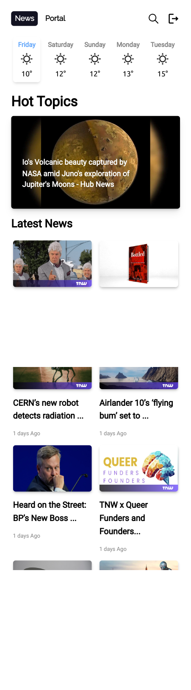

# Globtier News Site
Globtier News Website


## Prerequisites

Make sure you have [Node.js](https://nodejs.org/) installed on your machine.

## Getting Started & Run your project on Local

Clone this repository to your local machine:

   ```bash
   git clone https://github.com/satishpwebdev/globtier_news.git 
   ```

  
 ### Navigate to the project folder:
 ```bash 
 cd globtier_news
 ``````

 ### Install dependencies using npm:
````bash
npm install
``````
### Install Tailwind Css:
````bash
npm install -D tailwindcss postcss autoprefixer
```````

```bash
npx tailwindcss init -p
``````

### Running the Application
To start the local development server, run the following command:
```bash
npm run dev
```

## Sample Images




